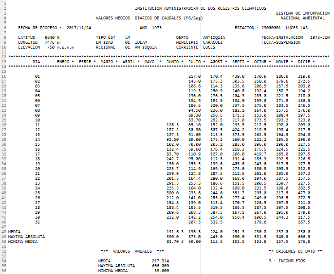

<style>
body {
text-align: justify}
</style>

```{r setup, include = FALSE}
knitr::opts_chunk$set(
  collapse = TRUE,
  comment = "#>"
)
```

The IDEAM (Instituto de Hidrología, Meteorología y Estudios Ambientales) is Colombian's Government Institution responsible for climatological, hydrological and oceanographic public stations network.  IDEAM's data is freely delivered under formal request. Records are grouped by stations, variable and time frame (hour, day, month, year).  Users who request IDEAM's databases receive records in plain text files, those files are difficult to manipulate owning to their text format and big files' extensions.
This package provides functions in order to transform and manipulate IDEAM's databases with daily records. ideamdb package allows users to transform the plain text files into R data frames or CSV files, which are adequate to manipulate for further analysis. Additionally, the package provides a function to make plots with the records alongside different subsetting options.
In the following sections, we explain the use of packages with an IDEAM´s database as an example.

## Data: `Example_IDEAM`
The example is a dataset with fictitious values of no real IDEAM's Stations.  The text file keeps IDEAM's text format, but it is a self-made file (see Figure 1). Original data could be freely required through IDEAM's web page <http://www.ideam.gov.co/solicitud-de-informacion>.

This dataset contains daily records of the following hydro-climatological variables: total values of precipitation (mm), average flows (m^3^/s), average relative humidity (%), average temperature (°C), minimum temperature (°C). The records correspond to the stations Lucero, Las Rosas, and Pailas. This file is an example dataset and it does not belong to IDEAM data.



## Convert IDEAM’s plain text into CSV file or data frame `IdeamWide()`

The function IdeamWide() allow users to convert IDEAM’s database into a data frame or to write a CSV file. The hydroclimatic databases provided by IDEAM have a plain format, wich does not allow for direct analysis of data; this function transforms databases to a data frame that can be used for an easy visualization or further manipulation.

`IdeamWide()` function contains the following structure and arguments:  

`ideamdb::IdeamWide(file, write = FALSE, outfile = "desired-name-for-output")`  
**file**:    IDEAM file path or file name if it is on the working directory  
**write**:   If True a CSV file is returned to the working directory, otherwise only a data frame is shown  
**outfile**: Outfile name that will be saved on the working directory  

Figure 2 shows a resulting data frame of applying `IdeamWide()` function.


  
## Convert IDEAM´s matrix style into a daily observations database `IdeamLong()`

Sometimes databases with wide format imply difficulties in order to undertake graphical representations or statistical analysis. IdeamLong() creates a ("tidy") database, where every observation corresponds to a row. This function allows an easier usage of the data with packages like ggplot.  

`IdeamLong()` function contains the following structure and arguments:  

`ideamdb::IdeamLong(file, write = FALSE, outfile = "desired-name-for-output")`  
**file**:    IDEAM file path or file name if it is on the working directory  
**write**:   If True a CSV file is returned to the working directory, otherwise only a data frame is shown  
**outfile**: Outfile name that will be saved on the working directory  

Figure 3 shows a resulting data frame of applying `IdeamLong()` function.


## Graphing data with `TimeSeries()`

The ideamdb package brings users with the function `TimeSeries()` a useful tool for initial exploratory data analysis. `TimeSeries()` provided two plots, first data in a time-series and second a boxplot of the data. Additionally, this function allows subsetting data according to arguments like Station and Variable.

`TimeSeries()` function contains the following structure and arguments:

`ideamdb::TimeSeries(file, station = "all", variable = "all")`  
file: IDEAM file path or file name if it is on the working directory  
station: a single station name or type "all" to plot everything  
variable: a single variable name or type "all" or "todas" to plot everything only a data frame is shown  

It is important to notice that TimeSeries() has by default station = "all", variable = "all". This means that the function creates graphs for every single variable and station. This is time demanding and unnecessary if you have a huge database and you are only interested in a specific station or variable. To deal with such situations, you can type the exact name of the desired station or variable. Here are some examples of possible using the Example_IDEAM file of the ideamdb package.  

Additionaly, `TimeSeries()` produces warning messages when data has missing values. The user should be informed but not concerned about it.  

`ideamdb::TimeSeries("Example_IDEAM", variable = "VALORES TOTALES DIARIOS DE PRECIPITACION (mms)")`  
`ideamdb::TimeSeries("Example_IDEAM", station = "all", variable = "VALORES TOTALES DIARIOS DE PRECIPITACION (mms)")`  
`ideamdb::TimeSeries("Example_IDEAM", station = "todas", variable = "VALORES TOTALES DIARIOS DE PRECIPITACION (mms)")`  
Print time series chart and boxplot for a specific variable in all stations.  

`ideamdb::TimeSeries("Example_IDEAM", station = "LUCERO")`  
`ideamdb::TimeSeries("Example_IDEAM", station = "LUCERO", variable = "all")`  
`ideamdb::TimeSeries("Example_IDEAM", station = "LUCERO", variable = "todas")`  
Print time series chart and boxplot for all variables collected in a specific station.  

`ideamdb::TimeSeries("Example_IDEAM", station = "LUCERO", variable = "VALORES TOTALES DIARIOS DE PRECIPITACION (mms)")`  
Print a time series chart and boxplot for a specific variable and station. Figure 4 and Figure 5 show the resulting graphs for this subsetting.  

  


Notice that although both Figure 4 and Figure 5 use the whole data, they are different. On the one hand, Figure 4 is a time series chart of daily data plotted through years of records. On the other hand, Figure is a boxplot (also known as box-and-whisker plot or box-and-whisker diagram) which arrange years of daily records in one graph with the twelve months of the year. Additionally, the boxplot is useful to identify data distribution in quartiles and outliers (statistical observations that are markedly different in value from the others of the sample).  
